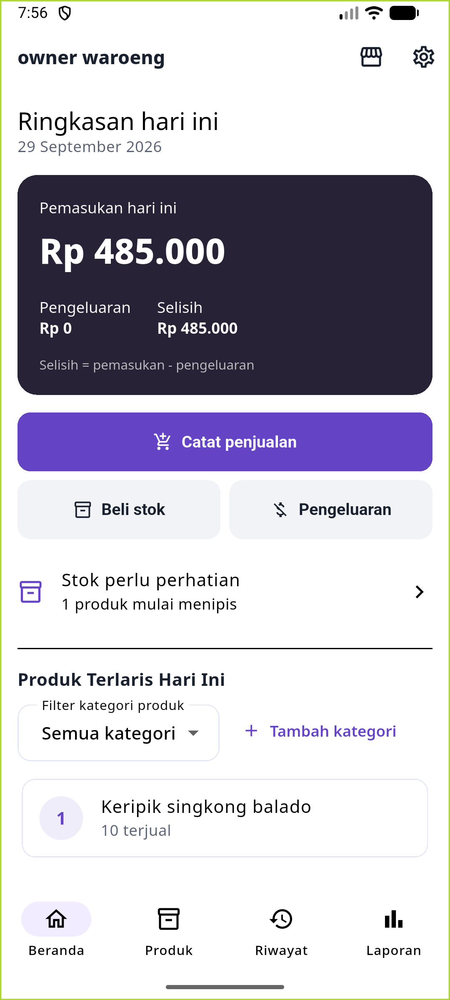
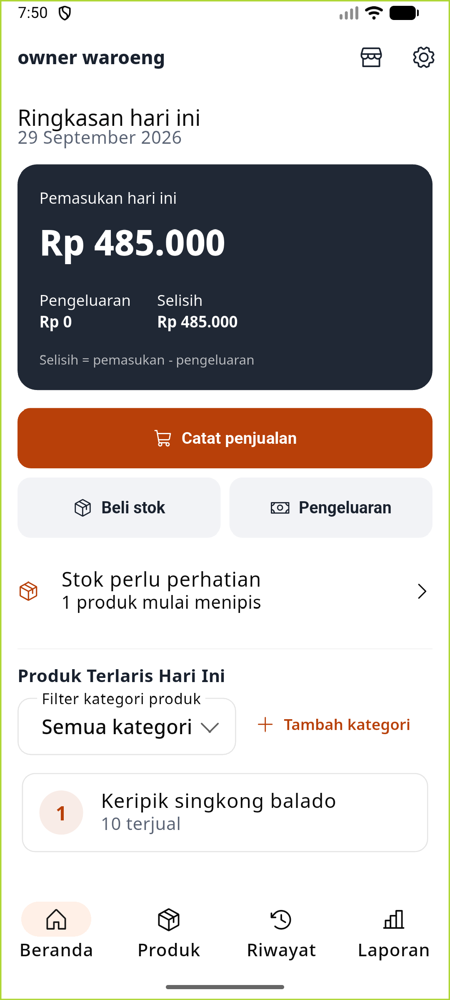

# owner waroeng

**Aplikasi kasir dan manajemen persediaan offline untuk warung dan usaha kuliner.**

owner waroeng membantu pemilik usaha mencatat penjualan, mengelola stok, memantau kinerja usaha, serta membuat backup data secara lokal. Aplikasi dirancang untuk Android dan tetap dapat digunakan tanpa akun atau koneksi cloud.

<p align="center">
  
  &nbsp;&nbsp;
  
</p>

<p align="center"><strong>Klasik - Ungu</strong> &nbsp; · &nbsp; <strong>Forui - Oranye</strong></p>

<p align="center">
  <a href="https://github.com/Partykel/owner-waroeng/tree/v1.1.0"></a>
  
  
</p>

## Fitur utama

- **Kasir:** catat penjualan multi-produk dengan harga pada saat transaksi dan pembaruan stok.
- **Produk dan persediaan:** tambah, ubah, cari, urutkan, dan hapus produk secara soft delete; kelola kategori produk serta pantau stok menipis.
- **Pembelian stok dan pengeluaran:** catat restock dan biaya operasional dalam riwayat transaksi.
- **Dashboard:** lihat pemasukan, pengeluaran, selisih, produk terlaris, serta grafik pemasukan tujuh hari.
- **Laporan:** tinjau ringkasan dan rincian transaksi berdasarkan periode.
- **Backup dan pemulihan:** ekspor atau pulihkan data usaha melalui satu berkas JSON. Pemulihan mengganti data lokal setelah konfirmasi dan membuat salinan pemulihan terlebih dahulu.
- **Pilihan tampilan:** gunakan tema Klasik - Ungu atau Forui - Oranye; preferensi disimpan di perangkat.

## Data dan privasi

Data usaha disimpan secara lokal pada perangkat menggunakan SQLite. Backup dibuat dalam format JSON dan **belum dienkripsi**; berkas tersebut dapat memuat data produk, stok, transaksi, serta preferensi tema. Simpan backup di lokasi yang hanya dapat diakses pihak tepercaya. Aplikasi ini tidak menggunakan akun atau sinkronisasi cloud.

## Rilis

Kode sumber untuk **versi 1.1.0** tersedia pada [tag `v1.1.0`](https://github.com/Partykel/owner-waroeng/tree/v1.1.0). APK dapat dibangun dari source code dengan mengikuti panduan di bawah. Build APK lokal menggunakan konfigurasi signing debug pada project saat ini dan ditujukan untuk pengujian; siapkan konfigurasi keystore rilis sendiri sebelum distribusi produksi atau publikasi ke Play Store.

## Menjalankan dari source code

### Persyaratan

- Flutter SDK dengan Dart `^3.11.1`.
- Android SDK dan perangkat atau emulator dengan Android API 26 atau lebih baru.
- Git.

### Menyiapkan dan menjalankan aplikasi

```bash
git clone --branch version-1.1 --single-branch https://github.com/Partykel/owner-waroeng.git
cd owner-waroeng
flutter pub get
flutter run
```

### Membangun APK untuk pengujian

```bash
flutter build apk --release
```

APK dihasilkan pada `build/app/outputs/flutter-apk/app-release.apk`.

Panduan pengaturan environment dan instalasi tersedia di [tutorial instalasi](tutorial_install_owner_waroeng.md).

### Memeriksa source code

```bash
flutter analyze
flutter test
```

## Teknologi

- **Flutter dan Dart** untuk aplikasi Android.
- **Riverpod** untuk pengelolaan state.
- **SQLite (`sqflite`)** untuk penyimpanan lokal.
- **`go_router`** untuk navigasi.
- **`fl_chart`** untuk grafik pada dashboard dan laporan.
- **Forui dan Material** untuk komponen serta tema antarmuka.

Identitas Android aplikasi: `com.pendodol.ownerwaroeng`.
